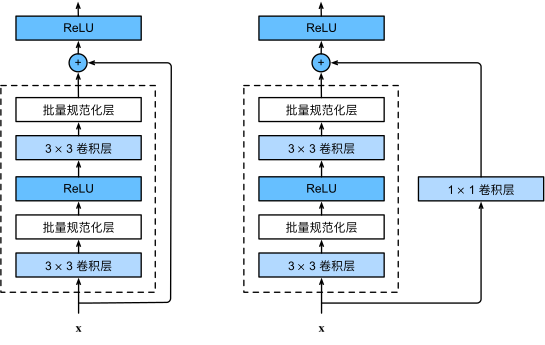
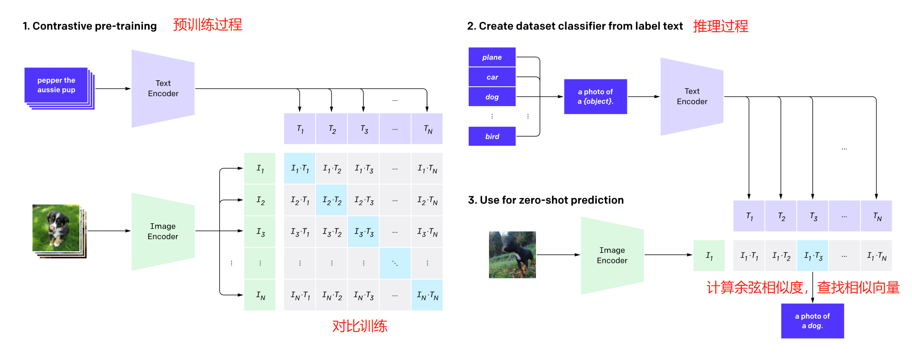
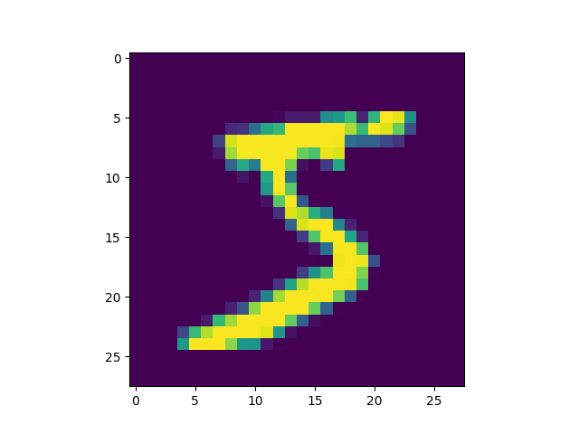
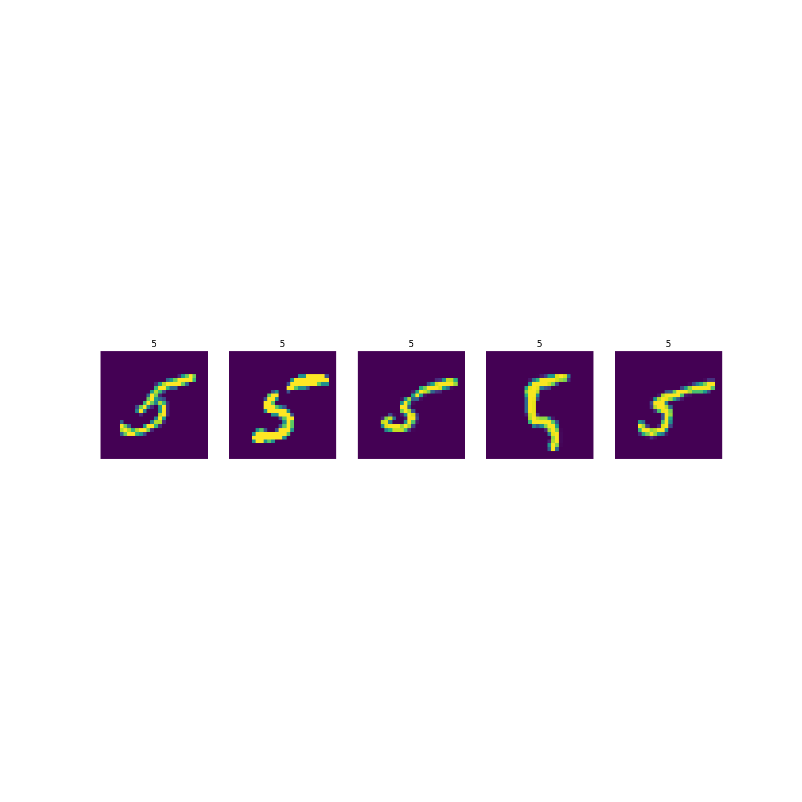

# mnist-clip

a super easy clip model with mnist dataset for study

基于mnist手写数字训练的clip模型，用作学习多模态模型的用途，只能预测0-9

## 模型

尝试过CLIP训练图文数据（coco等），loss收敛效果不好，可能是模型给的太复杂数据集太小导致的，所以就用mnist作为数据集用简单模型做一下了。

* img_encoder采用resnet残差网络结构，简单输出image embedding
* text_encoder没有用transformer，接收0~9数字ID，简单embedding+dense输出text embedding
* image embedding和text embedding做点积，得到logits，点积最大的(image,text)对最为相似

----

**resnet residual**



----

**clip model**


## 训练

python train.py

稍微训练一阵子，loss基本收敛到如下水平：

```
iter:0,loss:0.0012023616582155228
...
...
```

## 推理

python inference.py

```
正确分类: 5
tensor([[ -5.4331,  -3.2287, -13.9387,   6.4354,  -5.6840,  16.4233,   1.9771,
          -5.5376,   6.2783,   2.4510]], device='cuda:0',
       grad_fn=<MmBackward0>)
CLIP分类: 5
```

**要预测的图片**



**寻找的相似图片**

